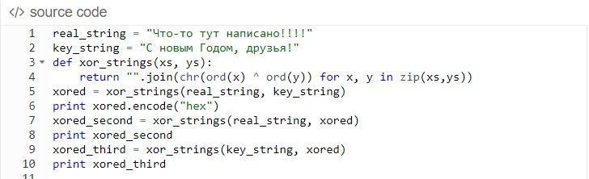
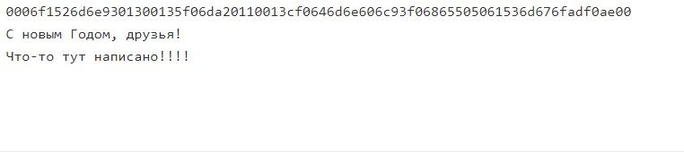

---
## Front matter
lang: ru-RU
title: Лабораторная работа №7
author: |
	Сидоракин
institute: |
	 RUDN University, Moscow, Russian Federation
date: Декабрь, 2021 Москва

## Formatting
toc: false
slide_level: 2
theme: metropolis
sansfont: NotoMono-Regular
header-includes: 
 - \metroset{progressbar=frametitle,sectionpage=progressbar,numbering=fraction}
 - '\makeatletter'
 - '\beamer@ignorenonframefalse'
 - '\makeatother'
aspectratio: 43
section-titles: true
---
## Цель лабораторной работы

Освоить на практике применение режима однократного гаммирования

## Пишем код приложения
{ #fig:001 width=50% }

## Получаем результат работы приложения
{ #fig:002 width=50% }

Первая строка соответствует зашифрованной информации, вторая строка – расшифрованному тексту, а третья – ключу.

## Вывод
В результате выполнения лабораторной работы мы освоили на практике применение режима однократного гаммирования.